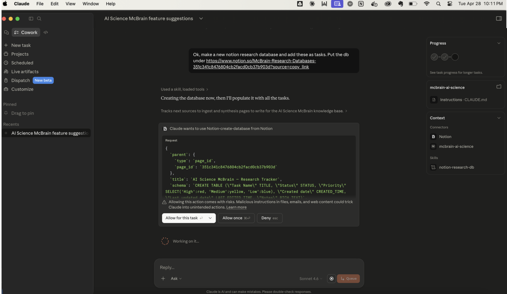
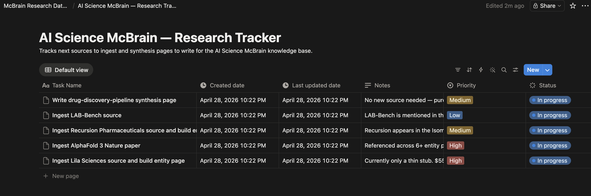

A Claude plugin for building and operating **McBrain** — a persistent, LLM-maintained personal knowledge base based on [Karpathy's LLM Wiki pattern](https://gist.github.com/karpathy/442a6bf555914893e9891c11519de94f) — plus companion skills for running research workflows through Notion. The plugin bundles four cooperating skills so you can install everything in one click from Claude Desktop.

The idea in one sentence: instead of re-deriving knowledge from raw sources every session, Claude builds and maintains a persistent markdown wiki that compounds over time. Obsidian is the IDE; Claude is the programmer; McBrain is the codebase.

## Requirements
- [Claude Cowork](https://support.claude.com/en/articles/13345190-get-started-with-claude-cowork) with an active Claude license
- [Obsidian](https://obsidian.md/)

## Recommended
- [Notion](https://www.notion.com/) Gives you a nice way to create research taskboards.
- A [GitHub](https://github.com/) account. Useful for backing up your McBrain.
- [Claude for Chrome extension](https://chromewebstore.google.com/publisher/anthropic/u308d63ea0533efcf7ba778ad42da7390) Very helpful for accessing data from websites that require you to login.
- [Obsidian Web Clipper](https://obsidian.md/clipper) Very helpful for when you're browsing the web and find something you want to save to McBrain

## Setup

This repo is itself a Claude plugin marketplace. Install it from Claude Desktop:

1. Open **Settings → Extensions → Directory → Plugins**.
2. Click the **+** next to your personal marketplaces and add this repo (e.g. `https://github.com/jbdamask/McBrain` or a local path).
3. Install the **mcbrain** plugin from the marketplace. All four skills are activated together.
4. Open a new Claude Cowork session and ask it to create a new McBrain for your topic of interest.

## Building Your Knowledgebase
I recommend you make many McBrains for whatever topics you want to build a knowledgebase around. This is what I do. Give them names like mcbrain-ai-research or mcbrain-house-stuff. Claude will be able to figure out which one to use based on your context.

The fastest way to get going is to open Claude Cowork, and ask it create a new McBrain. It will walk you through the configuration, doing most of it for you.
Once you're McBrain is ready, you can tell Claude to create a companion Notion research database and have Claude populate it with research items. Once that's done, you tell Claude to use the Notion Research Runner skill and it will a) select up to five records from the database and mark them as "In Progress"; b) fire up one subagent for each research task; c) do all the research, then write it up in the respective record.

Once your research is done, tell Claude to add it to your McBrain. It will copy all the research notes from Notion and ingest them into the wiki. Before you know it, you'll have a pretty big knowlege graph.


## Using it
Open a Claude Cowork session and start asking it about your McBrain of interest. "What did we learn?", "What are we missing?", "How does X relate to Y?". 
Each time you have a conversation with Claude about the contents of your McBrain, you think of new things and can have Claude add them. Over time, the not only does the knowlegebase grow but your ability (and Claude's) to understand it evolves.






## Query engine

Each McBrain vault ships with a built-in hybrid lexical + semantic query engine, provisioned automatically by `mcbrain-setup` (Step 8.5) and maintained by the `mcbrain-ops` skill. There's nothing to configure — `mcbrain-setup` creates a per-vault Python venv at `<vault>/.mcbrain/venv/`, installs the indexer dependencies, builds the initial search index, and patches your vault's `CLAUDE.md` to route queries through it.

- **Lexical** uses ripgrep (`rg`) when available, with a `grep` / pure-Python fallback so the lexical path always works.
- **Semantic** uses [FastEmbed](https://github.com/qdrant/fastembed)'s CPU-only ONNX embedding model (`BAAI/bge-small-en-v1.5`, 384 dims, ~30 MB). Queries like "cardiac event" still surface a page about *myocardial infarction* even though those words don't overlap.
- **Hybrid ranking** uses Reciprocal Rank Fusion (RRF) over the two modalities.

The embedding model lives in FastEmbed's shared cache (`~/.cache/fastembed/` on macOS/Linux, `%LOCALAPPDATA%\fastembed\` on Windows) so adding a second McBrain vault doesn't re-download it. Per-vault state — venv, index — lives at `<vault>/.mcbrain/` and is rebuildable from the wiki content. **No system-wide installs**: McBrain only detects whether `python3` and `rg` are available and surfaces install instructions if they aren't; everything else stays inside `<vault>/.mcbrain/`.

Existing vaults that pre-date the engine get an automatic migration prompt the next time the `mcbrain` skill is invoked against them.

## Skills bundled in the plugin

The `mcbrain` plugin contains five skills, all under [`plugins/mcbrain/skills/`](./plugins/mcbrain/skills):

### [`mcbrain-setup`](./plugins/mcbrain/skills/mcbrain-setup)
One-shot setup skill that bootstraps McBrain end-to-end: names the vault, configures a backup strategy, scaffolds the directory structure, writes the filesystem MCP config block for Claude Desktop, **provisions the per-vault query engine**, walks through Obsidian and browser-extension setup, and verifies the install. Run this from Claude Cowork each time you want to make a new McBrain.

### [`mcbrain`](./plugins/mcbrain/skills/mcbrain)
Day-to-day operating skill for McBrain. Handles ingesting sources into the vault, querying the wiki, filing synthesis pages, and linting. Supports multiple vaults (e.g. `mcbrain-finance`, `mcbrain-ai-science`) by mapping the user's request to the matching MCP filesystem server. Triggered by phrases like "ingest this", "save to mcbrain", "ask my brain", or any reference to the user's wiki / second brain.

### [`mcbrain-ops`](./plugins/mcbrain/skills/mcbrain-ops)
The query engine itself: a hybrid lexical + semantic search index over each vault's `wiki/`. Provisioned automatically by `mcbrain-setup` and called automatically by `mcbrain` after every wiki edit (to keep the index current) and at query time. You normally never invoke this directly — but it's the right skill if you ever need to rebuild the index, check its status, migrate an older vault, or remove the engine.

### [`notion-research-db`](./plugins/mcbrain/skills/notion-research-db)
Creates a Notion database scoped to a research topic, with a fixed schema for tracking tasks (Task name, Status, Priority, Created date, Last updated date, Notes). After creation, registers the database name and URL back into the associated McBrain vault so the wiki knows where its companion tracker lives. Works with any Notion MCP connector — matches tools by capability rather than exact name.

### [`notion-research-runner`](./plugins/mcbrain/skills/notion-research-runner)
Drains the "To do" queue of a Notion research tracker (the kind produced by `notion-research-db`). Pulls up to 5 tasks, flips them to "In progress", spawns a planning-then-executing research subagent for each, and writes the findings plus sources back to each task's Notion page.

## Typical workflow

1. Run **`mcbrain-setup`** once to scaffold a vault and wire up Claude Desktop + Obsidian.
2. Use **`mcbrain`** as you read, browse, and think — to ingest sources, query the vault, and file syntheses.
3. Use **`notion-research-db`** to spin up a research tracker for a new topic, then **`notion-research-runner`** to execute the queue. Findings can be ingested back into McBrain.

## Repo layout

```
McBrain/
├── .claude-plugin/
│   └── marketplace.json          # this repo is a marketplace
├── plugins/
│   └── mcbrain/
│       ├── .claude-plugin/
│       │   └── plugin.json       # the plugin manifest
│       └── skills/
│           ├── mcbrain-setup/
│           ├── mcbrain/
│           ├── mcbrain-ops/
│           ├── notion-research-db/
│           └── notion-research-runner/
├── README.md
└── LICENSE
```

## Running tests

The query engine has a pytest suite under [`tests/`](./tests/) covering pure-function unit tests, the CLAUDE.md patcher, the index lifecycle (rebuild / sync / status), search behavior (lexical cascade, semantic recall, hybrid query, lazy text fetch), and a full end-to-end lifecycle through the script's CLI. Organized following Kent C. Dodds' [Testing Trophy](https://kentcdodds.com/blog/the-testing-trophy-and-testing-classifications): the bulk of the investment lives in integration tests with a real SQLite DB and a real FastEmbed embedder.

```sh
python3 -m venv .test-venv
.test-venv/bin/pip install \
  -r plugins/mcbrain/skills/mcbrain-ops/references/requirements.txt \
  -r tests/requirements.txt

.test-venv/bin/python -m pytest tests/ -v
```

First run downloads the FastEmbed model (~30 MB) into `~/.cache/fastembed/`. Subsequent runs reuse it and complete the full suite in a few seconds. See [`tests/README.md`](./tests/README.md) for layout and design notes.

## License

See [LICENSE](./LICENSE).
