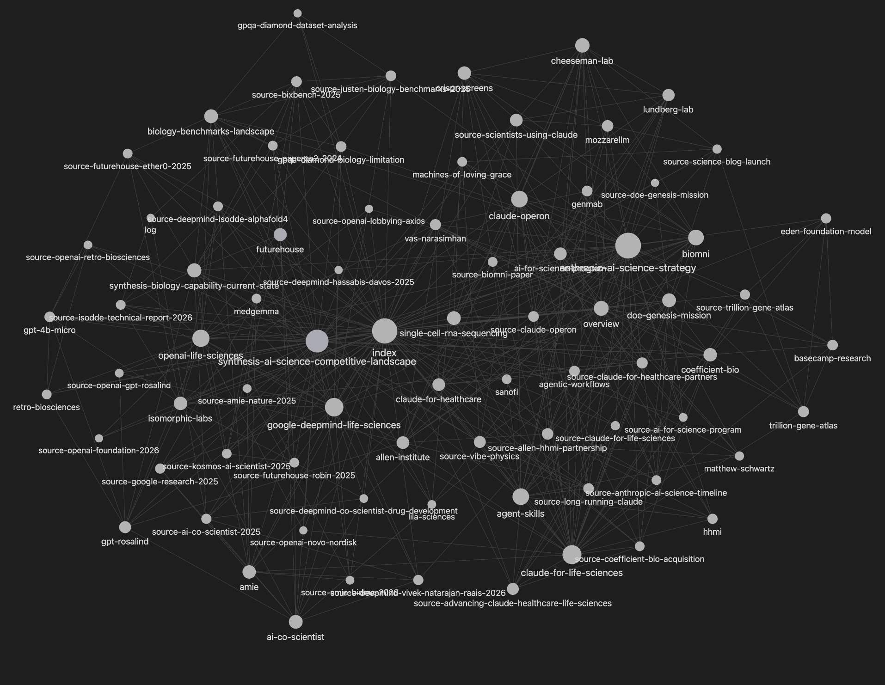
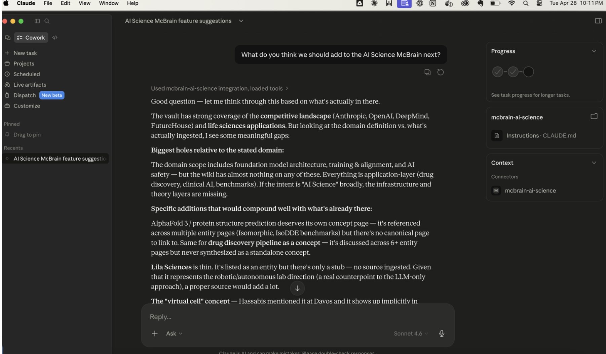
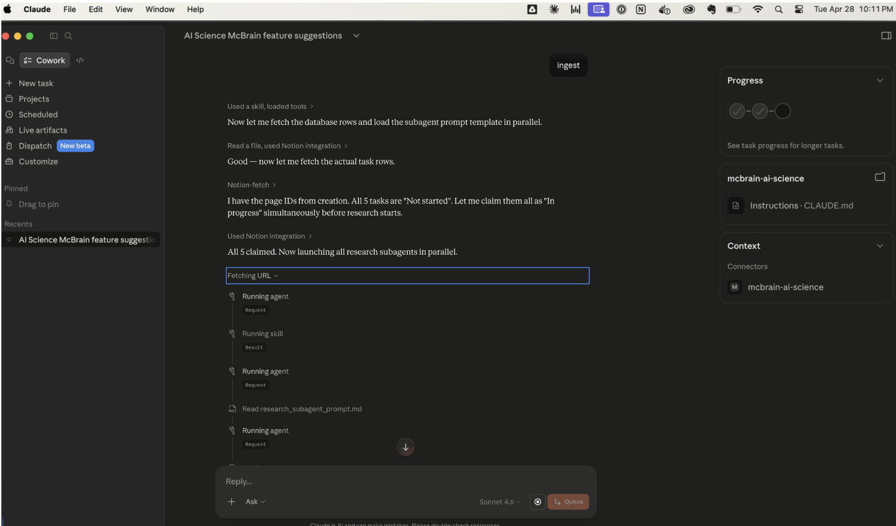

## What is this?
An easy-to-use tool for making personal knowledge bases in Claude Cowork. It's based on [Andrej Karpathy's LLM Wiki pattern](https://gist.github.com/karpathy/442a6bf555914893e9891c11519de94f)

> [!IMPORTANT]
> **Upgrading to 4.0.0?** Plugin 4.0.0 removes the hybrid lexical+semantic search engine (the `mcbrain-engine` MCP and the `mcbrain-ops` skill). Query against the wiki now reads `wiki/index.md` and follows `[[wikilinks]]` instead of calling a search tool. No migration tooling is provided — your existing vaults will keep working, but the `## Query engine` section in their `CLAUDE.md` (and any references to `mcbrain-engine` MCP tools) becomes inert. Two paths:
>
> 1. **Upgrade**: install 4.0.0 and accept the wiki-index-only Query flow. You may want to delete the `## Query engine` section and rewrite `### Query` in each vault's `CLAUDE.md` so Claude doesn't try to call tools that no longer exist; the templates in this version of `mcbrain-setup` show the new shape. You can also uninstall the `mcbrain-engine` MCP from your `claude_desktop_config.json` and delete the runtime directory at `~/Library/Application Support/mcbrain-engine/` (macOS) or `%LOCALAPPDATA%\mcbrain-engine\` (Windows).
> 2. **Work from the snapshot branch**: the pre-removal codebase is preserved at `origin/query-engine`. Check it out if you want to keep running the hybrid search.
>
> **Upgrading from a Notion-paired vault?** Plugin 3.0.0 removed the Notion backend; the local JSONL research tracker is now the only supported option. The pre-removal codebase is preserved at `origin/Notion`.

## Why is it useful?
Research used to be done by searching the internet for information, reading lots of pages, taking notes, then writing up a report. The more organized among us would create project folders to save their documents.

Recently, LLMs have streamlined much of this through their ability to search the web on their own and compile a report. But what happens if you want to steer the research in a certain direction? Or include pulic and proprietary data? Maybe you're a fan of Top Chef and want to see the cultural impact? Or maybe you're thinking of investing in a hot new AI startup that claims its going to disrupt the Electronic Health Records market? This takes more work and is usually best served by first compiling a bunch of information into a knowledge base and pointing Claude at it. 

Even though LLMs can work against a folder of files, it turns out that they are even better if the files are linked based on content. This is the same concept as Wikipedia: comphrehensive research is best done by reading connected documents.

Even better, McBrains are designed to grow over time. You can add content in a variety of ways and simply talk with Claude about the contents. One of the most useful aspects of this is that any insights that surface from chatting with your McBrain can be written back into the McBrain. This means that learnings are cumulative and available across all Claude sessions!

## Why is it called McBrain?
Because it's fast, easy, and you can live on it for a while. It's designed for personal use, not team or enterprise.

## How does it work?
Simply install the plugin in Claude Desktop and you can then make as many McBrain's as you want. Each McBrain lives on your computer as a set of folders and files. 

McBrain bundles several Skills that:
- Simplify setup and configuration from within Claude Cowork on Mac or PC.
- Create a research task database to help your knowledge base grow over time.
- Execute up to five research tasks in parallel using subagents.
- Ingest documents into the knowledge base.
- Adds confidence scores to information sources.
- Help you backup your McBrain to GitHub so you don't lose your knowledge base!

Research tasks are tracked in a **local JSONL file** inside the vault (zero dependencies, works offline). The plugin bundles four cooperating skills so you can install everything in one click from Claude Desktop.

The idea in one sentence: instead of re-deriving knowledge from raw sources every session, Claude builds and maintains a persistent wiki that compounds over time. 

## Requirements
- [Claude Cowork](https://support.claude.com/en/articles/13345190-get-started-with-claude-cowork) with an active Claude license
- [Node.js](https://nodejs.org) — required by the filesystem MCP server (`@modelcontextprotocol/server-filesystem`) that gives Claude read/write access to your vault. Claude Desktop launches it with `npx`, which ships with Node. Verify by running `node --version` in your terminal; if that fails, install from [nodejs.org](https://nodejs.org).

## Recommended
- A [GitHub](https://github.com/) account. Useful for backing up your McBrain.
- [Claude for Chrome extension](https://chromewebstore.google.com/publisher/anthropic/u308d63ea0533efcf7ba778ad42da7390) Very helpful for accessing data from websites that require you to login.
- [Obsidian](https://obsidian.md/) for viewing your knowledgebase. **Optional** — McBrain is just a folder of markdown files, so any editor (VS Code, Zed, Typora, plain `vim`) works. Setup never checks whether Obsidian is installed; Step 6 of `mcbrain-setup` is a GUI walkthrough you can skip if you don't use Obsidian. Obsidian is recommended because of its graph view, backlinks panel, and the Web Clipper extension.
- [Obsidian Web Clipper](https://obsidian.md/clipper) Very helpful for when you're browsing the web and find something you want to save to McBrain. Requires Obsidian; if you skip Obsidian, use Claude for Chrome or hand-drop files into `raw/` instead.

## Setup

This repo is itself a Claude plugin marketplace. Install it from Claude Desktop:

1. Open **Settings → Extensions → Directory → Plugins**.
2. Click the **+** next to your personal marketplaces and add this repo (e.g. `https://github.com/jbdamask/McBrain` or a local path).
3. Install the **mcbrain** plugin from the marketplace. All four skills are activated together.
4. Open a new Claude Cowork session and ask it to create a new McBrain for your topic of interest.

## Building Your Knowledgebase
I recommend you make many McBrains for whatever topics you want to build a knowledgebase around. This is what I do. Give them names like mcbrain-ai-research or mcbrain-house-stuff. Claude will be able to figure out which one to use based on your context.

The fastest way to get going is to open Claude Cowork, and ask it create a new McBrain. It will walk you through the configuration, doing most of it for you. During setup it will initialize a **local research tracker** — a JSONL file inside the vault — so you have somewhere to queue up topics you want Claude to research. See *[Research tracker](#research-tracker)* below for details.

Once your McBrain is ready, you can tell Claude to add research items to your tracker. Then tell Claude to "run the research queue" — `local-research-runner` will: a) claim up to five "To do" records and mark them "In progress"; b) fire up one subagent for each research task in parallel; c) do all the research, then write the findings back to the vault.

Once your research is done, the wiki ingest is automatic — findings land directly in `raw/notes/` where the standard ingest picks them up. Before you know it, you'll have a pretty big knowledge graph.




## Using it
Open a Claude Cowork session and start asking it about your McBrain of interest. "What did we learn?", "What are we missing?", "How does X relate to Y?". 
Each time you have a conversation with Claude about the contents of your McBrain, you think of new things and can have Claude add them. Over time, the not only does the knowlegebase grow but your ability (and Claude's) to understand it evolves.




## Research tracker

Each McBrain vault has a **local research tracker** — JSONL rows in a single file inside the vault at `<vault>/raw/research_tasks/tasks.jsonl`. One topic per row (with a `topic_slug` field), all topics in one file. `mcbrain-setup` Step 8 initializes it, and the choice is recorded in the vault's `CLAUDE.md` under a `## Research tracker` section. The `local-research-runner` skill drains "To do" rows, runs research subagents in parallel, writes one markdown file per completed task to `<vault>/raw/notes/research-<topic-slug>-<task-id>.md`, and flips the row to "Done". The standard ingest flow then picks the new files up alongside Web Clipper / hand-drop notes; no special bridged-ingest mode.

- **Zero external dependencies.** Just files in your vault.
- **Works offline.** Travel-friendly.
- **Atomic writes.** Concurrent writers (two terminals, future parallel-agent architectures) are serialized by an exclusive-create lock + `os.replace` rewrite — Python stdlib only, identical behavior on macOS, Linux, and Windows.
- **Hand-editable.** It's a JSONL file. Open it in your editor, append rows manually, change priorities, whatever.

To add a topic to the tracker, run the **`local-research-db`** skill (or just ask Claude). To drain the queue, run **`local-research-runner`** ("run my research queue", "drain the tracker").

## Skills bundled in the plugin

The `mcbrain` plugin contains four skills, all under [`plugins/mcbrain/skills/`](./plugins/mcbrain/skills):

### [`mcbrain-setup`](./plugins/mcbrain/skills/mcbrain-setup)
One-shot setup skill that bootstraps McBrain end-to-end: names the vault, configures a backup strategy, scaffolds the directory structure, writes the filesystem MCP config block for Claude Desktop, optionally walks through Obsidian and browser-extension setup (you can skip if you don't use Obsidian — McBrain works against the markdown vault directly), and verifies the install. Run this from Claude Cowork each time you want to make a new McBrain.

### [`mcbrain`](./plugins/mcbrain/skills/mcbrain)
Day-to-day operating skill for McBrain. Handles ingesting sources into the vault, querying the wiki, filing synthesis pages, and linting. Supports multiple vaults (e.g. `mcbrain-finance`, `mcbrain-ai-science`) by mapping the user's request to the matching MCP filesystem server. Triggered by phrases like "ingest this", "save to mcbrain", "ask my brain", or any reference to the user's wiki / second brain.

### [`local-research-db`](./plugins/mcbrain/skills/local-research-db)
Initializes a local research-task tracker for a McBrain vault — the JSONL file at `<vault>/raw/research_tasks/tasks.jsonl` and the matching `## Research tracker` registration in CLAUDE.md. Use this when you want a research backlog that lives entirely inside the vault, no external services. Run it once per topic to register additional topics on an existing local tracker.

### [`local-research-runner`](./plugins/mcbrain/skills/local-research-runner)
Drains the "To do" queue of the local JSONL research tracker. Atomically claims up to 5 rows (cross-platform exclusive-create lock + `os.replace`), spawns a planning-then-executing research subagent for each in parallel, writes findings as markdown files into the vault's `raw/notes/` directory with `source: local-research-tracker` frontmatter, and flips the rows to "Done". The standard ingest flow then picks the new files up — no special bridged-ingest mode.

## Typical workflow

1. Run **`mcbrain-setup`** once to scaffold a vault and wire up Claude Desktop (and Obsidian, if you use it — it's optional). Step 8 initializes the local research tracker.
2. Use **`mcbrain`** as you read, browse, and think — to ingest sources, query the vault, and file syntheses.
3. Add research tasks to your tracker (drag rows into `tasks.jsonl` or have Claude write them). When you're ready, ask Claude to "run the research queue" — `local-research-runner` drains the queue and findings flow back into the wiki.

## Repo layout

```
McBrain/
├── .claude-plugin/
│   └── marketplace.json          # this repo is a marketplace
├── plugins/
│   └── mcbrain/
│       ├── .claude-plugin/
│       │   └── plugin.json       # the plugin manifest
│       └── skills/
│           ├── mcbrain-setup/
│           ├── mcbrain/
│           ├── local-research-db/
│           └── local-research-runner/
├── README.md
└── LICENSE
```

## Running tests

A small pytest suite under [`tests/`](./tests/) covers the local research tracker behavior.

```sh
python3 -m venv .test-venv
.test-venv/bin/pip install -r tests/requirements.txt
.test-venv/bin/python -m pytest tests/ -v
```

See [`tests/README.md`](./tests/README.md) for details.

## License

See [LICENSE](./LICENSE).
